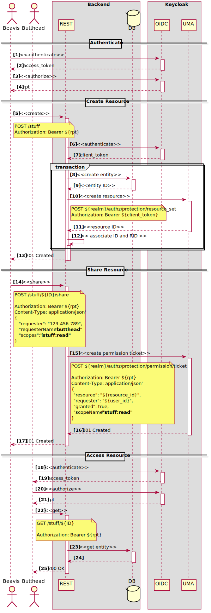

# Lab 10 : User-Managed Access (UMA 2.0)

This lab demonstrates how User-Managed Access (UMA 2.0) can be used in Keycloak to manage
access to resources (in this case photo albums). It consists of a simple application based on *Spring Boot*

For this application, users can be regular users or administrators. Regular users can create/view/delete their albums 
and administrators can do anything. Regular users are also allowed to share their albums with other users.

In Keycloak, albums are resources that must be protected based on a set of policies that defines the
access constraints.

The resources are also associated with a set of scopes that defines a specific access context. In this case, resources have
the following scopes:

* photo:create
* photo:view
* photo:view-detail
* photo:delete

The authorization requirements for this lab are based on the following assumptions:

* By default, any regular user can perform any operation on his resources.

    * For instance, Alice can create, view and delete her own photos. 

* Authorization for viewing and deleting photos can be granted by the owner to other users.

    * The owner can share specific photos with other users and define the scopes associated with each shared album.

* Administrators can view albums from all users (via Administration API) and can also delete any album.

* Regular users can only view their own profiles. The profile contains information such as the user id and number of albums 
  created.

* Administrators are only authorized to access resources if the client's ip address is well known

That said, this lab will show you how to use the Keycloak to define policies using:

* Role-based Access Control
* Attribute-based Access Control
* Rule-based policies using JavaScript 

This lab demonstrates how to enable User-Managed Access (UMA) in an application in order to allow users to manage access
to their resources using the *Keycloak Account Service*. It also shows how to create resources dynamically and how to
protecte them using the *Protection API* and the *Authorization Client API*. Here you'll see how to create a resource whose
owner is the authenticated user.

In addition it provides some background on how one can actually protect Rest endpoints using a *policy enforcer*.

## Folder Contents

In the lab 1 folder you find 2 applications:

* **photoz-service**, a simple RESTFul API based acting as a resource server.
* **photoz-app**, a Spring Boot client that will consume the RESTful API published by a resource server.


## Start the Lab

Let's this lab by creating the Example Realm and the Resource Server.

The Realm contains a Javascript Policy, so we need to restart our Keycloak using the following command :

   ````
   .\bin\standalone.bat -Dkeycloak.profile.feature.upload_scripts=enabled -Dkeycloak.profile.feature.scripts=enabled
 
   ````
Now, log in to the Keycloak Administration Console and create a new realm based on the following configuration file:


[photoz-realm.json](./photoz-realm.json)
 
That will import a pre-configured realm with everything you need to run this lab. For more details about how to import a realm 
into Keycloak, check the Keycloak's reference documentation.

After importing that file, you'll have a new realm called `photoz`.

## Deploy and Run the quickstart applications

To deploy the quickstart applications, first deploy the client:

1. Open a terminal and navigate to the root directory of this lab.

2. Enter the `photoz-app` module:

   ````
   cd photoz-app
   ````

3. Deploy the client application:

   ````
   ./mvnw spring-boot:run
   ````

The next step is to the deploy the `photoz-service` application:

1. Go back to the root directory of this lab.

2. Enter the `photoz-restful-api` module:

   ````
   cd photoz-service
   ````
   
3. Deploy the RESTFul application:

   ````
   ./mvnw spring-boot:run
   ```` 

Now, try to access the client application using the following URL:

    http://localhost:8080/app

If everything is correct, you will be redirect to Keycloak login page. You can login to the application with the following credentials:

* username: jdoe / password: jdoe
* username: alice / password: alice
* username: admin / password: admin

## Creating and Sharing Resources

The following schema explained the test senario we want to perform :



* Let's first login as Alice (username: alice, password: alice). Once logged in, the `photoz` client app will display a simple
page containing some links that can be used to display things like the RPT or the Access Token. While it is interesting to
view the token contents, we will focus on the main functionality of the app, which is managing photos.

* The next step will be creating a couple of photos. Click on the `Create` link to add an photo. For example purposes,
let's craete two random photos.

* In the home page we should now see a total of two photos owned by Alice.
* It is also possible to delete an album by clicking on the `[Delete]` link next to it but we won't do it for the moment.

Alice can now manage her albums and share them with other users. Click on the `My Account` link at the top of the page. You
will be directed to the Keycloak Account page. Next, click on `Resources`. It will show the two albums created before in
a table. Let's now share the albums with John Doe (jdoe):

* Click on the `Share` button for a photo of your choice. In the `Username or email` field enter the `jdoe` username
  and click on the `Add` button. Click on the `Select the permissions` field and select both `photo:view-detail` and `photo:delete`
  permissions from the drop-down menu. Click `Done` to confirm the changes.
* Alice can use this page at any time to view and change the permissions
  or revoke the access completely.
* Click the `ˬ` (arrow down) button next to thz photo you just shared with `jdoe` to expand the box. Notice the information that
  the resource is shared with `jdoe`.
* Now, click on the `Share` button for the second photo and enter `jdoe` username again. This time, select
  only the `album:view-detail` permission and confirm the dialog by clicking on the `Done` button.

So, to summarize, Alice has shared both her photos with John, giving him full permissions (`album:view-detail` and `album:delete`)
on the first one and only the `album:view` permission on the second.

Now click on the `Back to photoz-service` link at the top of the page to return to the application and then click on
the `Sign Out` link to logout.

## Viewing and Interacting with Shared Resources

Now let's login as John (username: jdoe, password: jdoe). The main page now shows photos that were shared with him. 

The list of albums shared with John displays two entries but notice how only one album has the delete link
that allows for the deletion of the album. For the second photo we have a different link: `Request Delete Access`.
This tells John that he doesn't have the permissions to delete this album and if he wants to do so he needs to ask Alice
(the owner) for the permission to do so. Let's do some things as John:

* First create an random photo. We won't be sharing this photo with anybody but the `admin`
should still be able to see it when he logs (we will cover that part later on) because administrators should be able to
see all the albums created by all users.
* The next step is to request Alice the permissions to delete the second photo. Click on the `Request Delete Access`
link. The app displays the following message:
   ````
   Sent authorization request to resource owner, please, wait for approval.
   ````
* Next click on the `My Account` link at the top of the page and then click on `Resources`. Notice how the page shows
both John's own resources and also the resources Alice shared with him (on `Shared with Me` tab).
* We won't be doing anything for now on this page, so let's just logout. For that, simply click on the `Sign Out` link at
the top of the page.

## Managing Permission Requests

We know now that John has sent Alice a request to obtain `photo:delete` for his own resource. So let's log back
in as Alice (username: alice, password: alice). We should be take straight to the Keycloak Account page. If you land at the
application main page click on the `My Account` link to go to the Keycloak Account page.

Click on the `Resources` link and now the page looks a little bit different. A button with `1` badge is displayed next to
the second photo. After clicking that button a modal dialog appears. It shows that John has requested
the `photo:delete` permission for the resource and it also displays two buttons, `Accept` and `Deny`. At this moment we will
approve John's request, so click on the `Accept` button.

Click on the `Back to photoz-app` link at the top of the page and then logout by clicking on the `Sign out` link.

Log back in as John (username: jdoe, password: jdoe) and notice how the second album now has the delete link active
next to it, meaning that John now has the permission to delete this album.

## Viewing All Resources

One of the requirements of the application is that administrators should be able to view and delete photos from all users,
so let's test this:

* If you are logged in as John or Alice, hit the `Sign out` link to logout.
* Sign in as the administrator (username: admin, password: admin). A list of all albums created so far
is displayed by user. 
* As a final exercise as the administrator, remove the a photo. Then logout and log back in as both
John and Alice to see how the album has been excluded.

## Revoking Permissions

As a final exercise let's say that Alice now doesn't trust John anymore so she wants to revoke the permissions she gave him.
Log in as Alice (username: alice, password: alice) and go to `My Account` and then click on `Resources`. She has now only
one photo as we removed the other one as administrators. Select `Edit` from the kebab menu for this
resource, remove all permissions from the `Select the permissions` field and confirm the changes by clicking the "check"
button next to that field. Finally, close the modal dialog by clicking `Done`. Alternatively, select `Unshare all` from
the kebab menu which would revoke access from all users Alice shared the album with.

Click on the `Back to photoz-app` link and the logout. Log back in as John (username: jdoe, password: jdoe) and
notice how John has not photos shared with him.

## Summary

This lab should provide a good overview of some of the core concepts of the Keycloak Authorization Services, such as
user-managed access (privacy control), resource sharing, and asynchronous authorization.
