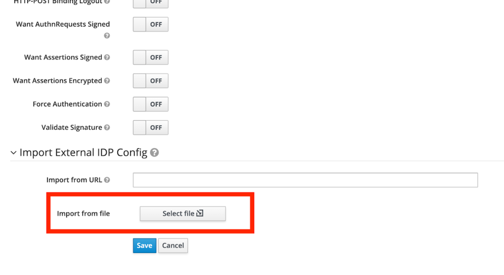
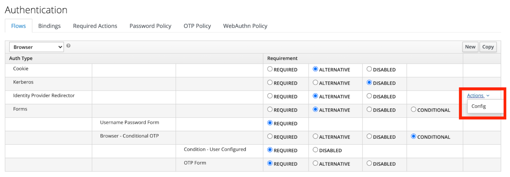

Lab 12 : SAML SSO using an external identity provider
=============================================================
In this lab you will learn how to set up and use Keycloak to broker JumpCloud SAML 2.0 logins.

We've based this configuration on the method described in the Keycloak Server Administration Guide's Identity Brokering section.

### Step 1: Create a new Realm in Keycloak
The first part of configuring the identity broker is to add a new Realm. This Realm will be where we will add the JumpCloud <-> Keycloak <-> The clients of your Realm.

* Set up and install Keycloak.
* Create a new Realm.

### Step 2: Configure JumpCloud

* Create and Log into your JumpCloud account.

* Go to the SSO page and click the + to add a new SSO Service Provider.

* Click Custom SAML App to add a custom Keycloak configuration.

* Add a Display Label (e.g., Keycloak).

* Choose an IdP Entity ID value that is unique to your identity and Keycloak instance (e.g., jumpcloud-keycloak; this value must be the same for both).

* Specify the SP Entity ID and the ACS URL for the JumpCloud SAML IdP that you want to connect with. These values be formatted similar to the following:

SP Entity ID: `https://<my-keycloak-url>/realms/<realm-name>`

ACS URL: `https://<my-keycloak-url>/realms/<realm-name>/broker/<keycloak-idp-alias>/endpoint`

* The remaining parameters can be left as is, so click Save to proceed.

* At this point, you should be able to open the Application Configuration backup on JumpCloud and export the IdP metadata to use with Keycloak.

* On the User Groups tab, add the JumpCloud User Group(s) that need access to Coder.

### Step 3: Configure Keycloak

* Log in to Keycloak as an admin, and navigate to the Realm you created at the beginning of this lab.

* Go to the Identity Providers page for your Realm and click SAML 2.0 to set up your identity provider (this Keycloak document provides additional information about adding a SAML 2.0 Identity Provider).

* On the IdP configuration page, specify an Alias to use for your IdP provider.

* Scroll to the bottom of the configuration page and upload the IdP metadata you exported from JumpCloud.

### Optional: Specify JumpCloud as the default IdP

* Navigate to Authentication.

* Select the Browser flow from the dropdown in the top-left.

* Find the Identity Provider Redirector row and click Actions > Config.
  

* Set Alias and Default Identity Provider to the alias of the identity provider you created earlier.

### Test the SAML login

TO DO 
