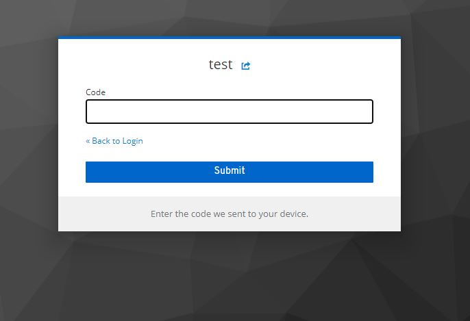

Lab 15 : Keycloak 2FA SMS Authenticator
=============================================================

Keycloak Authentication Provider implementation to get a 2nd-factor authentication with a OTP/code/token send via SMS (through AWS SMS).

### Step 1 : Install the custom Authentication Provider

First, build the code from this lab and copy the jar package to Keycloak deployement folder `{KEYCLOAK_HOME}/standalone/deployments`. 

### Step 2 : configure the authentication flow

From the Authentication menu, we start by duplicating the default Browser flow and choose a new name `Browser with SMS` : :

Add a new execution :

And select our new provider :

Add the phone number user attribute where the SMS code will be sent :

The final authentication flow should look like this :

In the `Bindings` section, select this authentication flow you just configured :

 
### Step 3 : Test the login flow

After checking the login/password, the user is prompted with a second screen to submit an OTP :

The SMS is sent through a fake API and the code to use is displayed on Keycloak logs :
 

