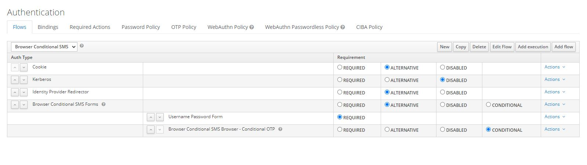
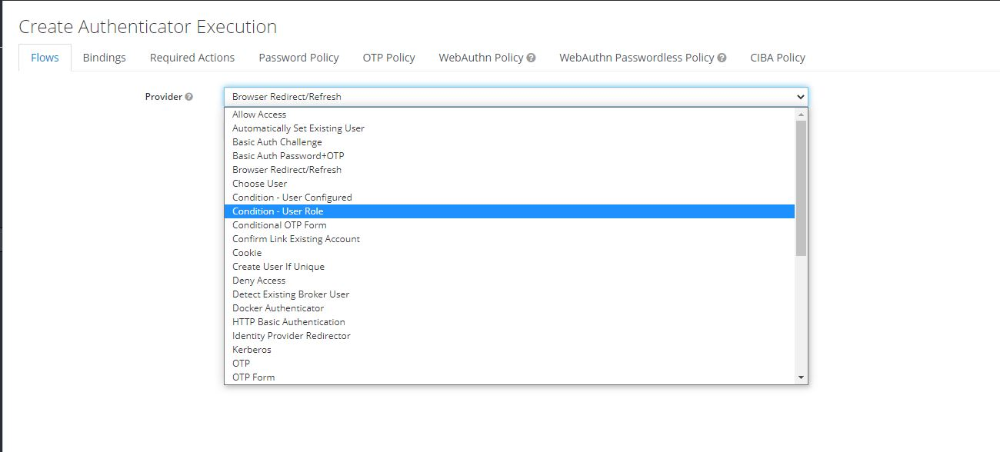
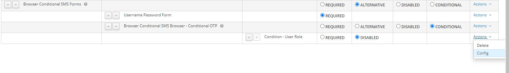
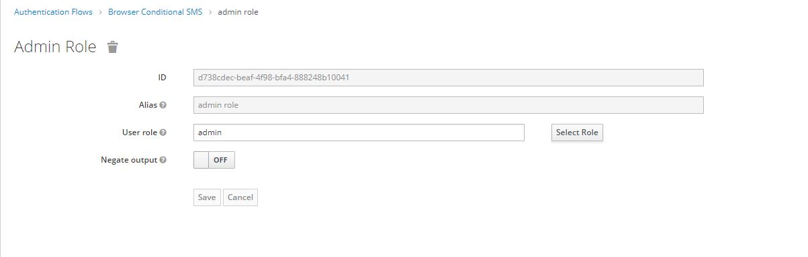
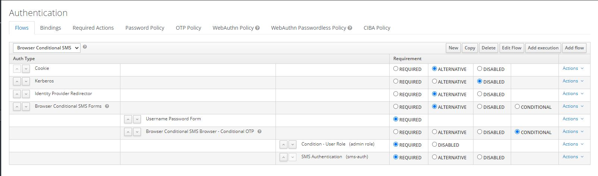

Lab 15 : Conditional Keycloak 2FA SMS Authenticator
=============================================================

In this lab, you will learn how to configure a conditional authentication flow for 2FA Authentication.

Basically, we will edit the authentication flow we built on the previous [lab](../lab15) in order to enable 2FA only for admin accounts, and keep classic login/password page for simple users.

### Step 0 : Prerequisite
- A Realm with at least 2 users and 2 roles (Admin and User)
- Completing the previous [lab](../lab15)

### Step 1 : Add a new Authenticator Execution

The starting point is what we configured in the previous [lab](../lab15) :

We create a new Authenticator Execution :

And then we open the configuration page related to this new Authenticator :

Select the admin role :

This will enable this authenticator only for admin accounts. 

The final configuration will look like this :

### Step 2 : Test

Now it's time to test your new flow : try to login using different accounts (Admin and a simple user) so you can see the difference.

 

   