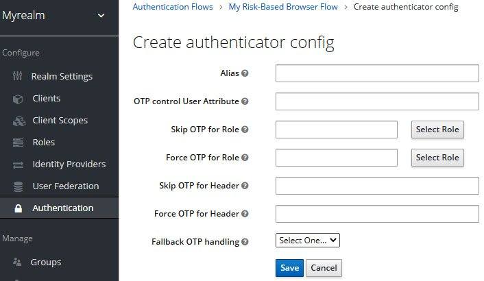
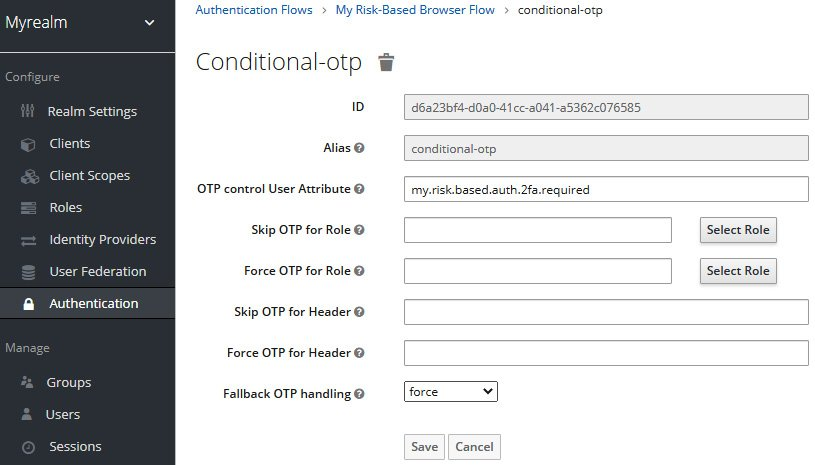
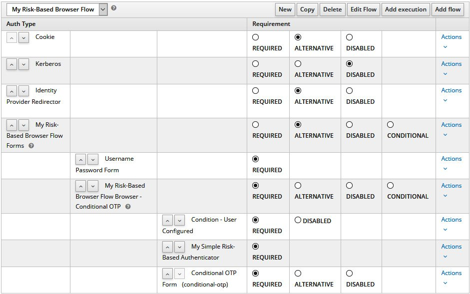
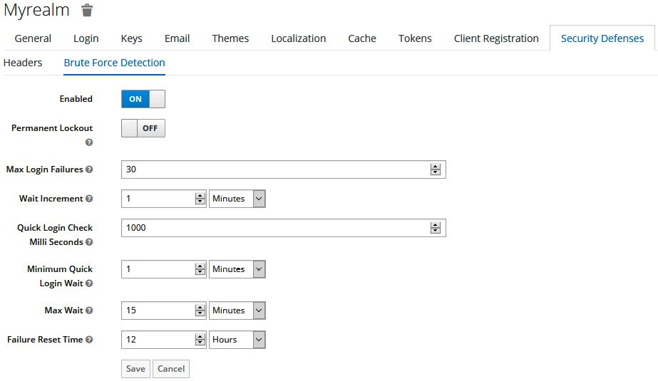

# Lab 12 : Simple Risk-Based Authenticator

We are not going to cover in this lab all the details pertaining to the Authentication SPI, but give you a code example to help you understand the steps and the mechanics when you are creating your own authenticators. The code example for this lab is available under the following folder [simple-risk-based-authenticator](./simple-risk-based-authenticator).

The example here is about a quite simple authenticator that relies on a risk score to determine whether the user should provide a second factor when authenticating. The risk score is calculated based only on the number of failed login attempts, where, if a user fails to log in three times in a row, the next time they will be forced to provide a One-Time Password (OTP) as a second factor. However, you could leverage this example to something more complex where the risk analysis could also consider other factors, such as the device the user is using, the location, or even the score from an external fraud detection system.

## Setup :

To install the custom authenticator, you need to deploy the provider's JAR file as follows:


```
$ cd lab19/simple-risk-based-authenticator
$ ./mvnw clean package
$ cp target/simple-risk-based-authenticator.jar $KC_HOME/standalone/deployments
```

After deploying the provider, you are going to configure a new authentication flow as follows:

1. Create a copy of the **Browser** flow and name it **My Risk-Based Browser Flow**.
2. Delete the OTP Form execution from the **My Risk-Based Browser Flow Browser - Conditional OTP** sub-flow. Make sure that the sub-flow is marked as **REQUIRED**.
3. Add the **My Simple Risk-Based Authenticator** execution to the **My Risk-Based Browser Flow Browser - Conditional OTP** sub-flow.
4. Add the **Conditional OTP Form** execution to the **My Risk-Based Browser Flow Browser - Conditional OTP** sub-flow. Make sure that this execution is marked as REQUIRED.
5. Go to the Bindings tab and associate the **My Risk-Based Browser** flow with the Browser flow.
6. Now, click on the **Actions** link for **Conditional OTP Form** execution and then click on the **Config** option:



At this page, you should provide the following configuration:

- **Alias**: conditional-otp
- **OTP control User Attribute**: my.risk.based.auth.2fa.required
- **Fallback OTP handling**: force

Once you are done, click on the **Save** button:



At the end, the new **My Risk-Based Browser Flow** should look like this:



Finally, let's enable the **Brute Force Detection** feature to the realm. This feature is responsible to track failed login attempts and avoid brute force attacks when an attacker is trying to guess users' passwords. The custom authenticator we just configured relies on this feature to track the number of failed login attempts. To enable the feature, click on the **Realm Settings** item on the left-side panel. Once at this page, click on the **Security Defenses** tab and then click on the **Brute Force Detection** sub-tab. Once at this tab, turn on the **Enabled** setting:



## Test :

Let's now log in to the account console using the **alice** user. For that, open your browser at http://localhost:8080/realms/myrealm/account and log in using the user's credentials.

At this moment, you should be able to authenticate to the account console by providing only a password.

Now, log out from the account console and, when at the login page, try to log in again but using an invalid password. Repeat this step three times.

On the fourth occasion, provide the correct password of the user. If everything is correct, you should now be asked to configure an OTP to then authenticate and access the account console. Next time you try to authenticate after failing to log in three times, you should only be asked for the OTP.
