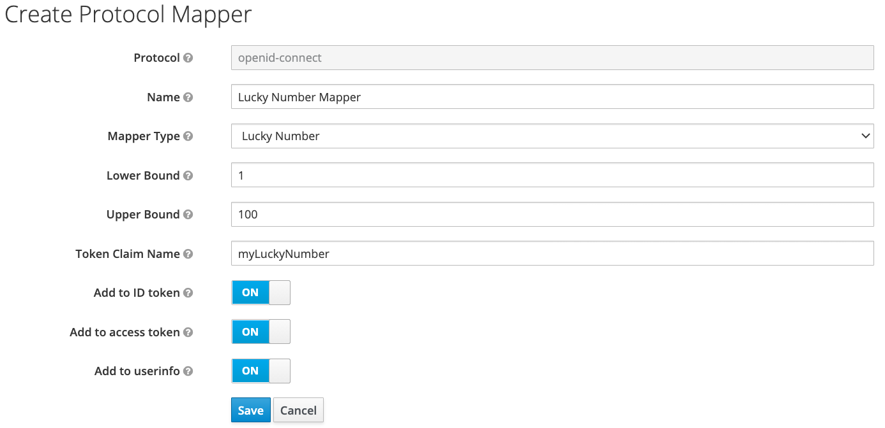

# Lab 21 : Custom protocol token mapper

Keycloak provides the possibility to implement custom #protocol #mappers to map custom data into access and id token, and the user info endpoint. In this lab demonstrate how to implement a basic protocol mapper for the OIDC protocol and using and configuring it in a client context.

You can configure the mapper with an upper and a lower bound and it will generate a random lucky number (integer) and maps it into the specified token(s) (and userinfo endpoint) to the specified claim.

